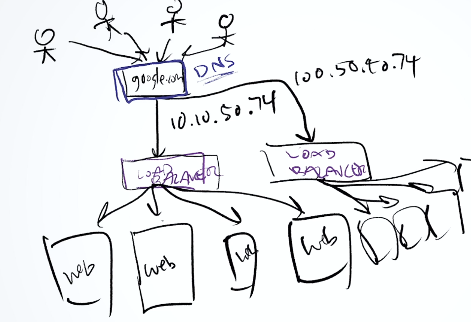
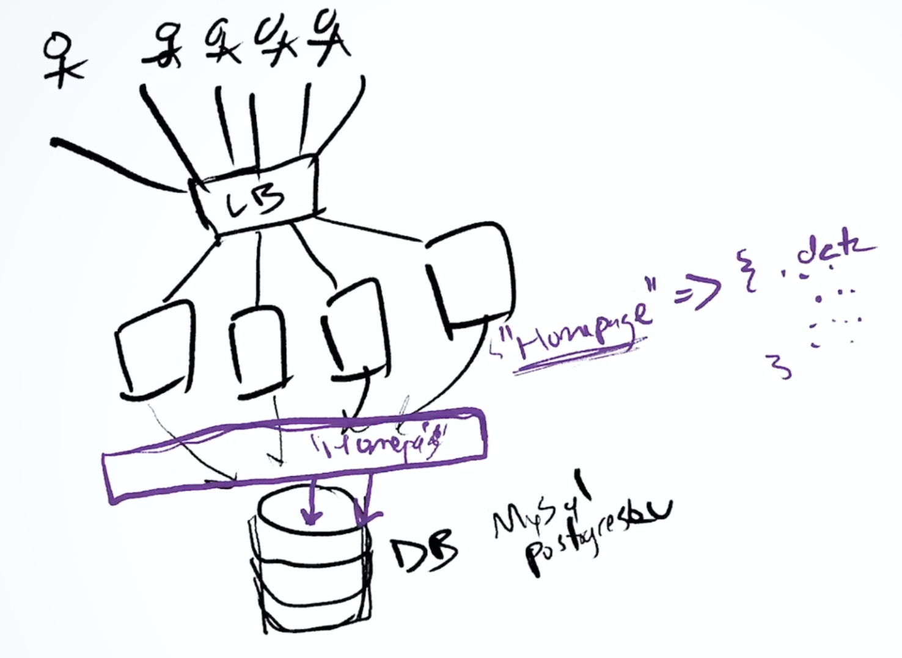
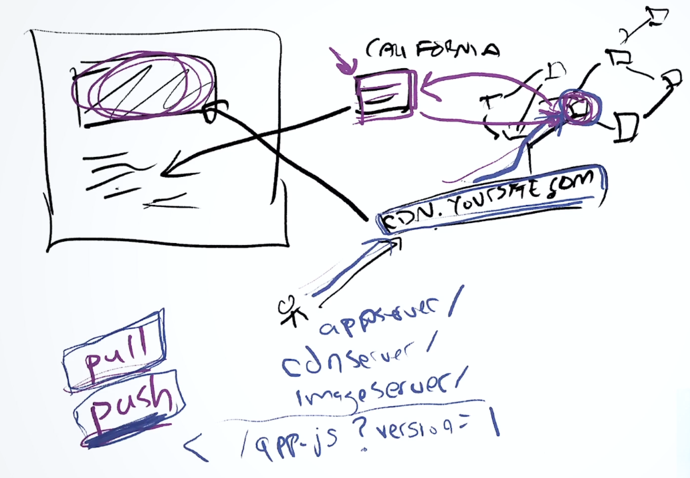

# System Design

## Approach to system design

- scope the problem and ask clarifying questions. (usecases, constraints, goal, what does success look like in the system - there is no single right answer - its all about tradeoffs)
- which area and what degree you gonna focus on your optimization and scaling on.

## Core building blocks for scaling up an apllication

### Load balancing

- for scaling any web application.
- solves overloading of web server as more and more clients access the web server.
- job of loadbalancer is to distribute (or redirect) loads to bunch of different web servers.
- simply redirecting a url request is going to be far lighter weight and less processor intensive than actually handling the requests and generating the response.
- loadbalancer is really just another machine like a linux server running some specialized software like NGINX, AWS elastic load balancing, etc.
- what if the loadbalancer itself gets overloaded? solution - multiple loadbalancers
  - 
- we can configure the way loadbalancer distributes the load across the web servers. some common algorithms like round robin, least load, or custom scripts, etc. We can also configure ping to check the health of web servers.
- one more way in which you can do load balancing is really just at the application level. Dividing the application by its features like mail service, web service, chat service, db service, etc (microservices).
- essentially with load balancing technology, people no longer needed a single very strong monolithic powerful server, instead we can have tons of cheap commodity level servers, CPUs, memory and then just add these machines to the load balancer and easily start scaling up a web app across millions of people. So now we are able to have infinite computing power.
- problem: single point of failure for loadbalancer. solution: multiple loadbalancers.

### Caching

- how to fasten fetching (reading) data from database servers? solution: insert caching layer above the database layer.
  - 
- caching massively reduces the amount of load on the database.
- cache is really just another machine like a linux server running some specialized software like memcached, redis, cassandra, etc (caching systems).
- cache is just a bunch of key-value pairs. So the web servers first look for the key in cache, if it exists (cache hit), then they read from cache. Otherwise (cache miss) they look in the database to fetch it and store that into the cache for future use. So caching massively reduces the amount of load on the database.
- essentially these caching data stores are just key-value pairs. Because of that they are highly distributed and scale very well. we can group together a bunch of servers and run some caching system like memcached across all of those distributed machines. So anytime memcached need to store the information, it just picks one of the available machine and stores data in it. And then memcached can just read back from that machine using just a simple hashing function to determine where that key is stored.
- quite often these caching data stores are in-memory. So they are not necessarily persisting data to disk (They can like in case of redis. But disk is usually much slower as we have to spin through hard drives). Because the data is often just stored in-memory, it is extremely fast for both reading and writing. Its essentially almost the fastest thing that we have out there. Its highly distributed and can scale across millions of machines if you needed to. And each of these machines can be configured with more and more memory.
- caching is great for high write scenarios. example: you are updating a counter for the total number of visitors on the website.
- why caching bad?
  - data often isn't in memory. There is a good chance that we can lose the data if there is a power outage. So you dont usually want to put high value user data in there. Usually its just something redundant. Maybe data that you can stand to lose because there is another copy of it in the actual database.
  - some caching data stores like redis have the ability to persist their in-memory data onto disk, such that even if you lose power, you still retain that data.
  - 2 strategies for persisting in-memory data: (tradeoff - performance vs consistency)
    1. write through cache (low performance and high consistency): When you write into the cache, you also write into the database layer under it. Because of this, write slowed down tremendously as you have to wait for the database to finish writing data onto the disk. And that task can be locked up if there are a whole bunch of different writes coming in at the same time. But the benefit of this is if there is a lot more reads happening in your system, then the write through cache could work.
    2. write back cache (high performance and low consistency): When you write into the cache, you are pretty much done. But then there is this background process that will slowly go through all of the writes and persist those onto the disk. But the problem here is that there is some inconsistency between whats in the cache and whats in your database. And if you suddenly were to lose power, then there could be some data that would be lost.
- configuring caches on what to do when they run out of space? then data in the cache could be kicked out for a more relevant data.
  - first in first out order
  - least recently used
- caching is really not that complicated. Example: API for memcached is really just get(key) and set(key, value).
- we can also use cache for storing temporary data.

### Content delivery networks (CDN)

- how do you make sure that any type of static files like images, assets, videos are being loaded quickly for users in anywhere in any part of the world? solution: CDN
- CDN is essentially a series of distributed servers across the world that can cache your data.
- lets say we have our primary web server or db server in India. Now a user from USA accesses our website. So he need to download many static files like images, js scripts, etc. So it's gonna take much longer time to download all static files from the original web server based in India as opposed to if these static files are already be cached (CDN) at the location geographically near to him (like USA).
- flow: CDN url for static file (like image) in our website --> CDN looks for nearest CDN cache/server --> loads static file from that CDN server.
- 2 techniques for implementation of CDN: (tradeoff - performance vs cost) --> Here generally pull is better than push.
  1. pull (very first request is slow and CDN costs/fees/charges are low): static file url request to CDN cache/server. if cache miss, then redirect to original source web server.
  2. push (very first request is fast and CDN costs/fees/charges are high): load all static files to CDN cache/server at start. So all requests are served by CDN cache/server itself (cache hit always).
- sometimes we update static files like js scripts. So we usually append an extra url parameter like version (<www.cdn.server.com/app.js?version=2>) to refresh the CDN cache to get the updated static file.
- 

### Relational databases and indexing

- indexing makes database searching faster.
- index is a binary search tree in the database based on the certain field. So time complexity for searching is logarithmic.
- DBMS internally uses B trees and B+ trees for indexing.
- classification of indexing techniques:
  - single level index (binary search tree)
    - primary index (on [primary key or unique key] + table rows ordered on that attribute)
    - clustering index (on non key + table rows ordered on that attribute)
    - secondary index (on [primary key or unique key]/non key + table rows unordered on that attribute)
  - multi-level index
    - static (n-ary search tree)
    - dynamic (B tree and B+ tree)
- a composite index (also known as a compound index) is an index that is created on two or more columns of a database table. It allows for efficient querying when the query involves filtering, sorting, or both, based on multiple columns in combination.

### Redundancy and replication

-
